# Microsoft Intune MAM Test アプリ 

MAMTest プロジェクトを自分の環境でビルド・実行するための手順を説明します。

<details>
<summary><h2>1. JDK のインストール</h2></summary>

2025年11月時点では、JDK 17 が比較的安定しているとのことで、こちらをインストールします。

### 1.1 JDK 17 のダウンロードとインストール

1. [Adoptium Temurin JDK 17](https://adoptium.net/temurin/releases?version=17&os=any&arch=any) から、JDK 17 - LTS の Windows 版をダウンロードします。

2. ダウンロードしたインストーラーを実行してインストールします。

### 1.2 環境変数の設定

以下の環境変数を設定します：

```powershell
# システム環境変数を設定
JAVA_HOME = C:\Program Files\Eclipse Adoptium\jdk-17.x.x
Path に %JAVA_HOME%\bin を追加
```

**確認コマンド**:
```powershell
PS C:\Users\hatakemu> java -version
openjdk version "17.0.17" 2025-10-21
OpenJDK Runtime Environment Temurin-17.0.17+10 (build 17.0.17+10)
OpenJDK 64-Bit Server VM Temurin-17.0.17+10 (build 17.0.17+10, mixed mode, sharing)

PS C:\Users\hatakemu> javac -version
javac 17.0.17
```

</details>

<details>
<summary><h2>2. Android Studio のインストール</h2></summary>

### 2.1 Android Studio のダウンロードとインストール

1. [Android Studio とアプリツールのダウンロード - Android デベロッパー](https://developer.android.com/studio) から Windows 64 bit 用のインストーラーをダウンロードします。

2. ダウンロードしたインストーラーを実行してインストールします。

**注意**: アンインストールが必要な場合は、[こちらのサイト](https://codeforfun.jp/how-to-completely-uninstall-android-studio/) が参考になります。（コントロールパネルからアンインストールするだけでは、多くのコンポーネントが残ります。）

### 2.2 初回セットアップ

1. インストール後、Android Studio を起動します。

2. **"Install Type"** 画面で **"Standard"** を選択します。

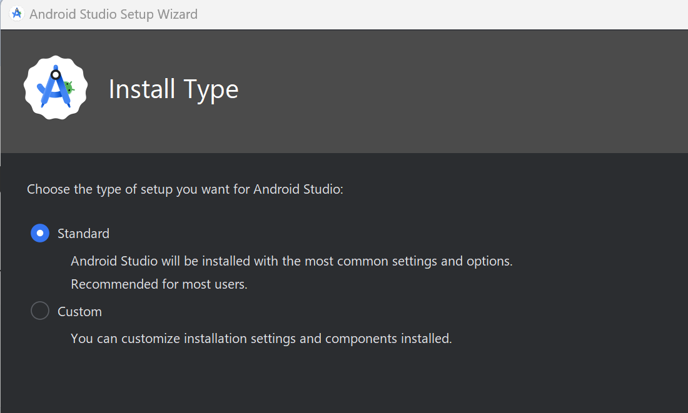

3. **"License Agreement"** で **"Accept"** を選択してコンポーネントをインストールします。

### 2.3 Android SDK の設定

1. Android Studio を起動後、**"More Actions"** から **"SDK Manager"** を選択します。

2. **"SDK Platforms"** タブで以下をインストールします：
   - **Android 14.0 ("UpsideDownCake")** - API Level 34（2025年10月時点で Intune SDK 安定稼働バージョン）

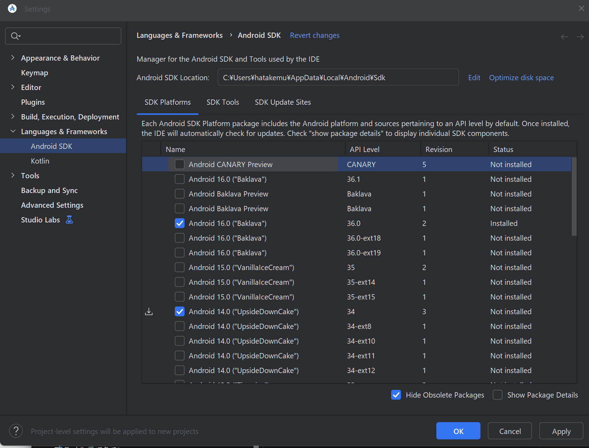

3. **"OK"** をクリックしてインストールします。

### 2.4 新しいプロジェクトの作成（デバッグ用キーストア生成）

デバッグ用のキーストアを作成するため、新しいプロジェクトを作成します：

1. Android Studio で **"New Project (+)"** から **"Empty Activity"** を選択します。

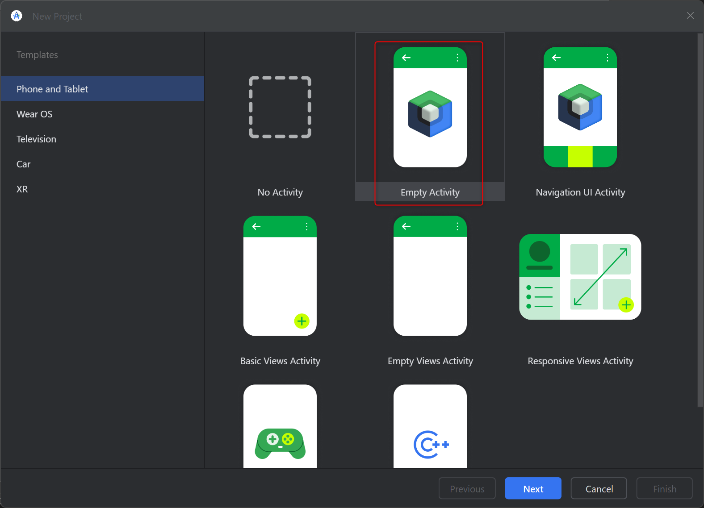

2. `C:\Users\<ユーザー名>\.android\debug.keystore` が作成されたことを確認します。
   プロジェクトをクローンする場合には、新しいプロジェクトは不要なので必要に応じて削除します。自分でプロジェクトを作成する場合には、名前や Package name を入力して作成します。
   Package name は一意である必要があり、後に作成する Entra アプリにも指定するものです。

### 2.5 Android SDK 環境変数の設定

以下の環境変数を設定します：

```powershell
# Android SDK環境変数を設定
ANDROID_SDK_ROOT = "C:\Users\<ユーザー名>\AppData\Local\Android\Sdk"
Path に C:\Users\<ユーザー名>\AppData\Local\Android\Sdk\platform-tools を追加
```

**確認コマンド**:
```powershell
PS C:\> adb version
Android Debug Bridge version 1.0.41
Version 36.0.0-13206524
Installed as C:\Users\hatakemu\AppData\Local\Android\Sdk\platform-tools\adb.exe
Running on Windows 10.0.22621
```

### 2.6 Android エミュレータの作成

1. Android Studio 右側の **"Device Manager"** アイコンをクリックします。
2. **"Create Virtual Device"** を選択します。

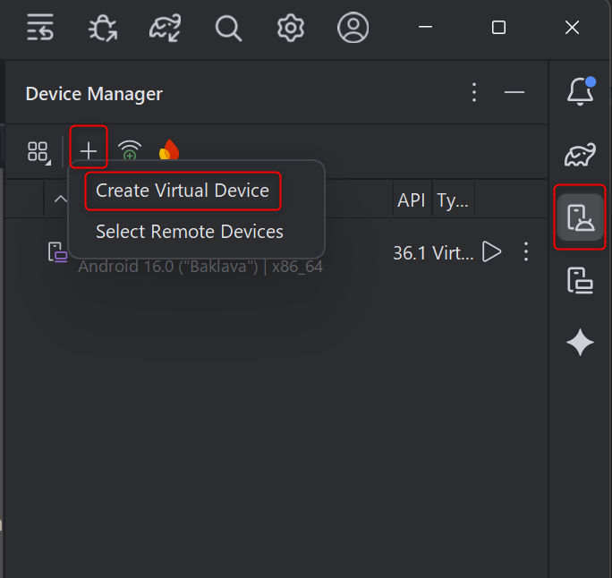

3. **"Phone"** カテゴリから **"Pixel 8"** を選択します（API バージョン 34 - Android 14 対応）

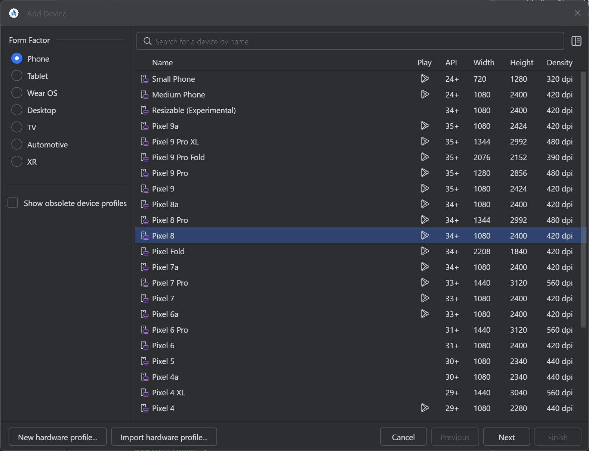

4. **"API 34 'UpsideDownCake', Android 14.0"** を選択します。

5. **"★マーク"** のついたダウンロードコンポーネントをクリックしてシステムイメージをダウンロードします。

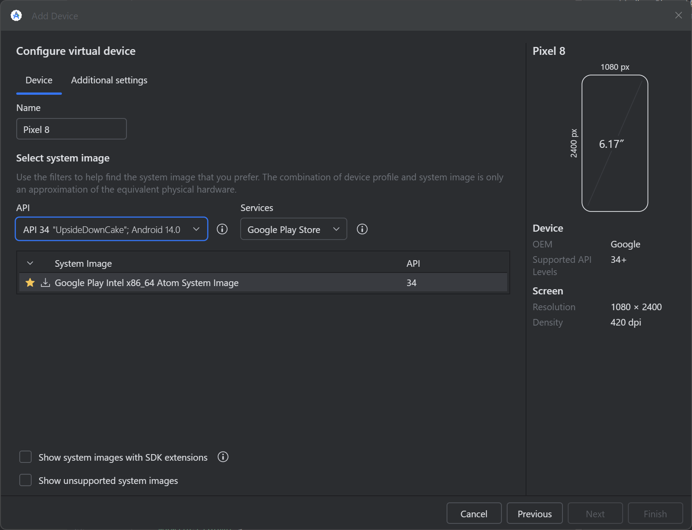

6. **"Finish"** をクリックしてデバイスを作成します。

</details>

<details>
<summary><h2>3. プロジェクトのダウンロード</h2></summary>

```powershell
cd C:\Users\<ユーザー名>\AndroidStudioProjects
git clone https://github.com/hatakemu/MAMTestAndroid.git <任意のプロジェクト名>
```

Git を使っていない場合には、[MAMTestAndroid](https://github.com/hatakemu/MAMTestAndroid) から ZIP ファイルをダウンロードして、`C:\Users\<ユーザー名>\AndroidStudioProjects` 配下に展開してください。

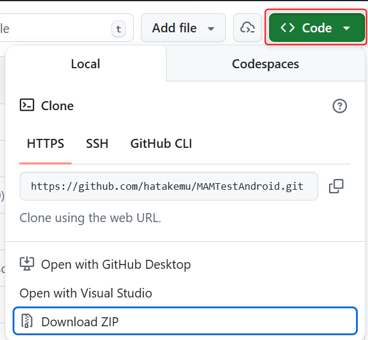

Android Studio で **"File"** - **"Open"** から展開したプロジェクトフォルダーを選択すると、Android Studio 上のプロジェクトとして読み込まれるはずです。

**ビルドエラーが表示される場合**  
この時点でビルドエラーが表示される場合、以下をお試しください。
- PC を再起動後、`app/build` および `app/release` フォルダを削除します
- Android Studio を起動して、**"Build"** - **"Clean Project"** を実行します
- Android Studio から、**"File"** - **"Invalidate Caches"** を開き、**"Invalidate and Restart"** を実行します

上記を実施してもビルドエラー（デバッグモード）が取れない場合には、VS Code でプロジェクトを開き、エラー内容について Github Copilot に対応を聞くと、だいたい対処してくれます。現時点では、リリースモードのキーストアが作成されていないため、リリースモードでのビルドは失敗します。

</details>

<details>
<summary><h2>4. リリースビルド用のキーストアを作成</h2></summary>

Android Enterprise に Managed Google Play から限定公開アプリとして配布するためには、リリースビルド用の署名がついた .apk ファイルが必要です。そのため、リリースビルド用のキーストアを作成します。

### 4.1 Android Studio でのキーストア作成

1. Android Studio で **"Build"** → **"Generate Signed App Bundle or APK..."** を選択します。

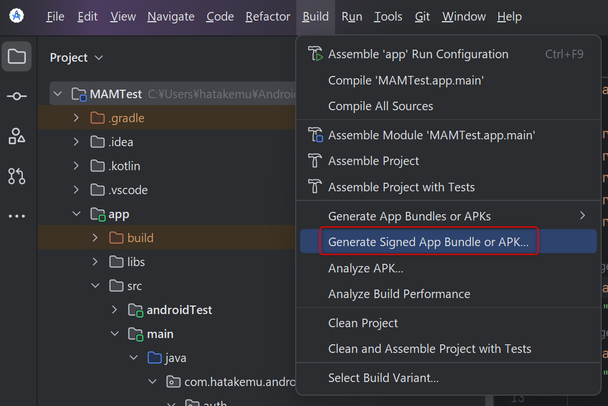

2. **"APK"** を選択して **"Next"** をクリックします。

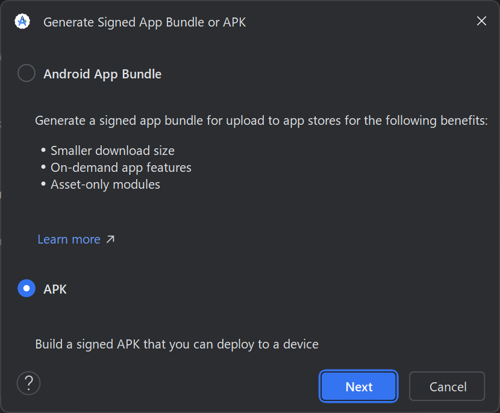

3. **"Create new..."** をクリックして新しいキーストアを作成します。

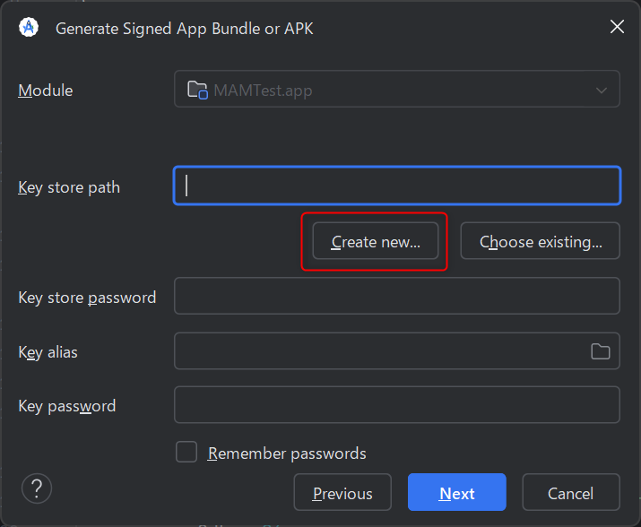

4. キーストア情報を入力します。
   - **Key store path**: キーストアファイルの保存場所を指定
   - **Password**: キーストアのパスワードを設定
   - **Key Alias**: キーのエイリアス名
   - **Key Password**: キーのパスワードを設定
   - **Validity (years)**: 有効期限
   - **Certificate**: 発行者情報を入力
     - "First and Last Name": 氏名
     - "Organizational Unit": 部署名
     - "Organization": 組織名
     - "City or Locality": 市区町村
     - "State or Province": 都道府県
     - "Country Code (XX)": 国コード（JP）

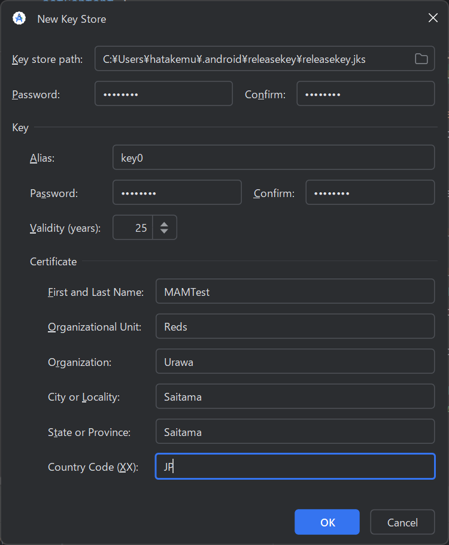

5. **"OK"** をクリックしてキーストアを作成します。指定したパスにキーが作成されていることを確認します。

</details>

<details>
<summary><h2>5. キーのハッシュ値を取得</h2></summary>

Android アプリで MSAL を利用する場合、キーのハッシュ値を Entra に登録するアプリに指定する必要があります。デバッグ用、リリース用のキーのハッシュ値をここで取得しておきます。

**デバッグ用のキーのハッシュ値取得**
```powershell
# デバッグ署名の SHA1 を抽出
$sha1Line = keytool -list -v -keystore "$env:USERPROFILE\.android\debug.keystore" `
  -alias androiddebugkey -storepass android | Select-String -Pattern "SHA1:\s*([0-9A-F:]+)"

# コロンを除去して Base64 エンコード
$hex   = ($sha1Line.Matches[0].Groups[1].Value -replace ":", "")
$bytes = for ($i=0; $i -lt $hex.Length; $i+=2) { [Convert]::ToByte($hex.Substring($i,2),16) }
$base64Std = [Convert]::ToBase64String($bytes)
$base64Std

**出力例**
PS C:\WINDOWS\system32> $base64Std
Nli7ogtDVf4QgBfSiuIrWDWEymU=
```

**リリース用のキーのハッシュ値取得**
```powershell
# リリース署名キーストアとエイリアス (各環境毎の値に置き換えてください)
$keystore = "C:\Users\hatakemu\.android\releasekey\release.jks"
$alias    = "key0"

# keytool 実行（対話でパスワード入力）
$out = & keytool -list -v -keystore $keystore -alias $alias
--> キーストアのパスワードを入力

# SHA1 行を抽出
$sha1Line = $out | Select-String -Pattern "SHA1:\s*([0-9A-F:]+)"

# コロンを除去して Base64 エンコード
$hex   = ($sha1Line.Matches[0].Groups[1].Value -replace ":", "")
$bytes = for ($i=0; $i -lt $hex.Length; $i+=2) { [Convert]::ToByte($hex.Substring($i,2),16) }
$base64Std = [Convert]::ToBase64String($bytes)
$base64Std

**出力例**
PS C:\WINDOWS\system32> $base64Std
8w2Zbr8qkGWysNZAl1DlAgmu1AA=
```

</details>

<details>
<summary><h2>6. パッケージ名の変更（任意）</h2></summary>

本アプリのパッケージ名は `com.hatakemu.android.mamtest` です。自分独自のパッケージ名（例：`jp.co.android.mamapp` を使用したい場合、以下の手順で変更します。

### 6.1 build.gradle.ktsの変更

**ファイル**: `app/build.gradle.kts` の **namespace** と **applicationId** を変更します。

```kotlin
android {
    namespace = "jp.co.android.mamapp" ★
    defaultConfig {
        applicationId = "jp.co.android.mamapp" ★
        // ...
    }
}
```

### 6.2 フォルダ構造の手動作成

`app/src/main/java/` 配下に新しいフォルダ構造を作成します。

```
app/src/main/java/
└── jp/
    └── co/
        └── android/
            └── mamapp/
```

### 6.3 ファイルの移動とpackage宣言の変更

1. 既存の`.kt`ファイルを新しいフォルダに移動します。

2. 各ファイルの先頭の`package`宣言を変更します。

```kotlin
// 変更前
package com.hatakemu.android.mamtest

// 変更後  
package jp.co.android.mamapp
```

### 6.4 import文の一括置換

VS Codeの検索・置換機能などを使用して、パッケージ名を置き換えます。

- **検索**: `com.hatakemu.android.mamtest`
- **置換**: `jp.co.android.mamapp`
- **対象**: `**/*.kt`, `**/*.xml`, `**/*.json`


### 6.5 AndroidManifest.xmlの更新

**ファイル**: `app/src/main/AndroidManifest.xml` の **android:host** を変更します。

```xml
<data
    android:scheme="msauth"
    android:host="jp.co.android.mamapp" ★
    android:path="${redirectPath}" />
```

### 6.6 MSAL設定ファイルの更新

**ファイル**: `app/src/debug/res/raw/msal_config.json` および `app/src/release/res/raw/msal_config.json` の **redirect_uri** のパッケージ名部分を変更します。

```json
{
  "redirect_uri": "msauth://jp.co.android.mamapp/YOUR_SIGNATURE_HASH",
  // ...
}
```

### 6.7 クリーンビルド

一度クリーンビルドを行い、ビルドが通ることを確認します。

```powershell
cd <プロジェクトフォルダーのパス>
.\gradlew.bat clean
.\gradlew.bat assembleDebug
```

### 6.8 旧フォルダの削除

新しいパッケージ構造でビルドが通ることを確認後、`app/src/main/java/com/hatakemu/android/mamtest/` フォルダを削除します。

</details>

<details>
<summary><h2>7. Entra アプリの登録</h2></summary>

### 7.1 アプリの登録

[Entra 管理センター](https://entra.microsoft.com) で **アプリの登録** から新規アプリを登録します。**名前** には任意のアプリ名を入力し、そのまま **登録** します。
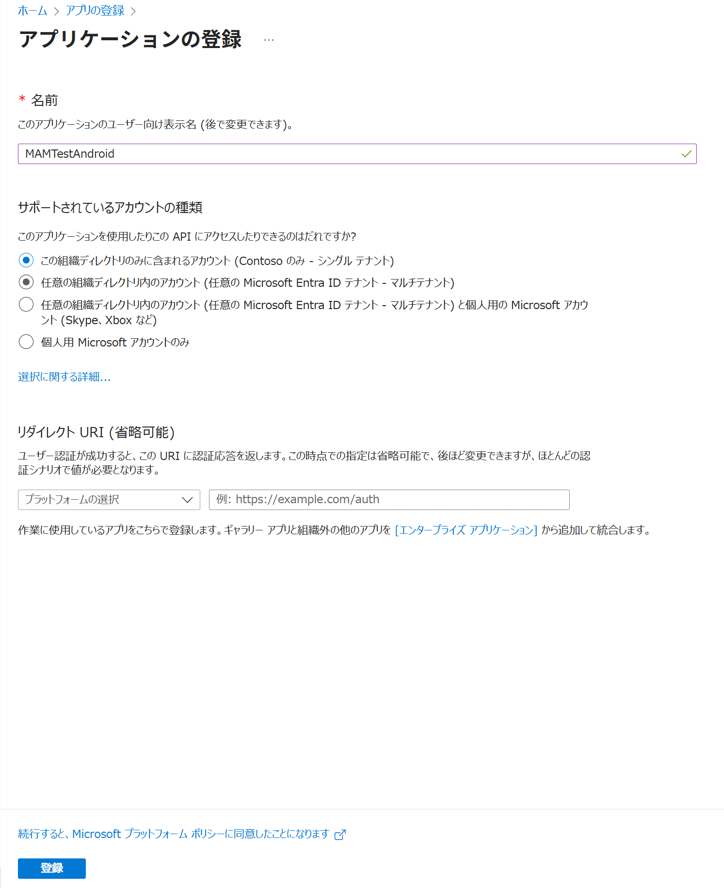

### 7.2 プラットフォームとリダイレクト URI の設定

1. 登録したアプリの **認証** を選択し、**プラットフォームを追加** から **Android** を選択します。
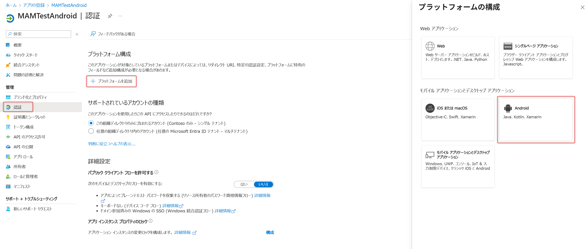

2. **パッケージ名** と **署名ハッシュ** をそれぞれ入力して構成します。

- **パッケージ名**: アプリのパッケージ名
- **署名ハッシュ**: デバッグ用のキーハッシュ値
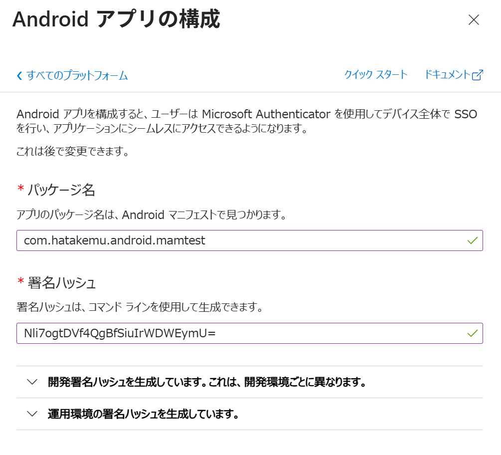
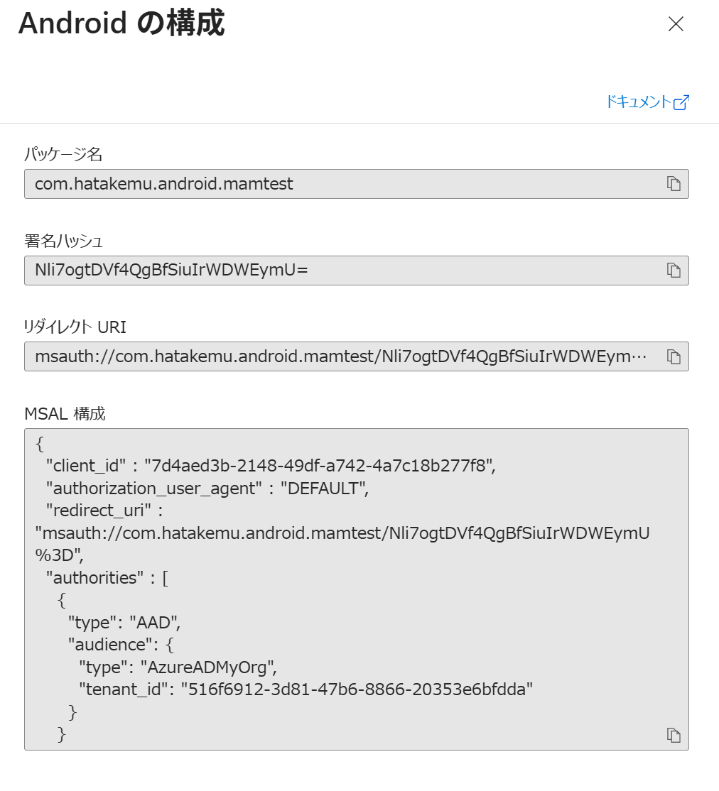


3. 上記で追加したプラットフォーム構成の **URI の追加** から **パッケージ名** と **署名ハッシュ** を追加します。

- **パッケージ名**: アプリのパッケージ名
- **署名ハッシュ**: リリース用のキーハッシュ値
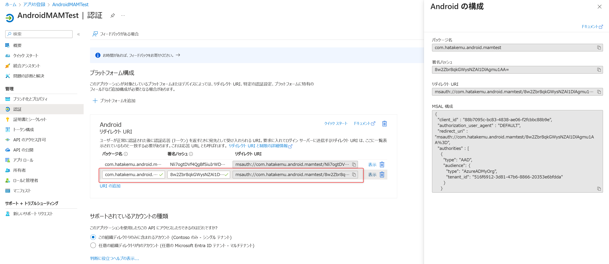

4. **保存** します。


### 7.3 API アクセス許可の設定

1. 作成したアプリの **API のアクセス許可** から **アクセス許可の追加** を選択し、以下の API のアクセス許可を追加します。

- **Microsoft Mobile Application Management** の **DeviceManagementManagedApps.ReadWrite** (MAM 用)

**"所属する組織で使用している API"** を選択し、**Microsoft Mobile Application Management** で検索をして、表示された **DeviceManagementManagedApps.ReadWrite** にチェックを入れてアクセス許可を追加します。
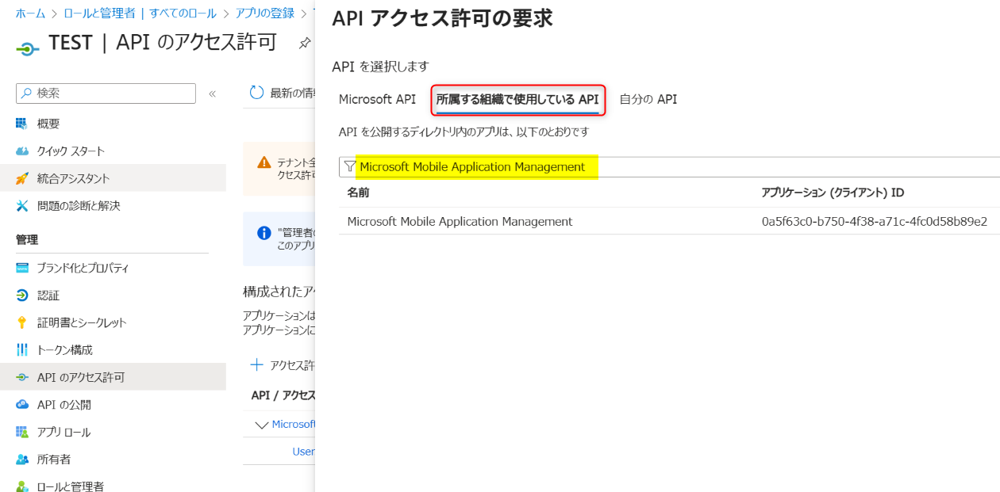
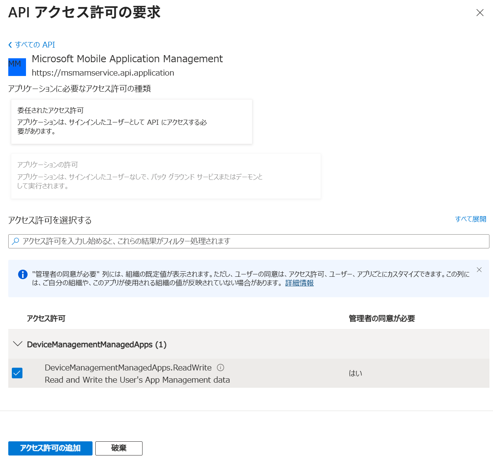


- **Microsoft Graph** の **Files.ReadWrite** (OneDrive 読み書き用)

**Microsoft API** の **Microsoft Graph** を選択し、**委任されたアクセス許可** を選択して、**Files.ReadWrite** を検索してチェックを入れてアクセス許可を追加します。
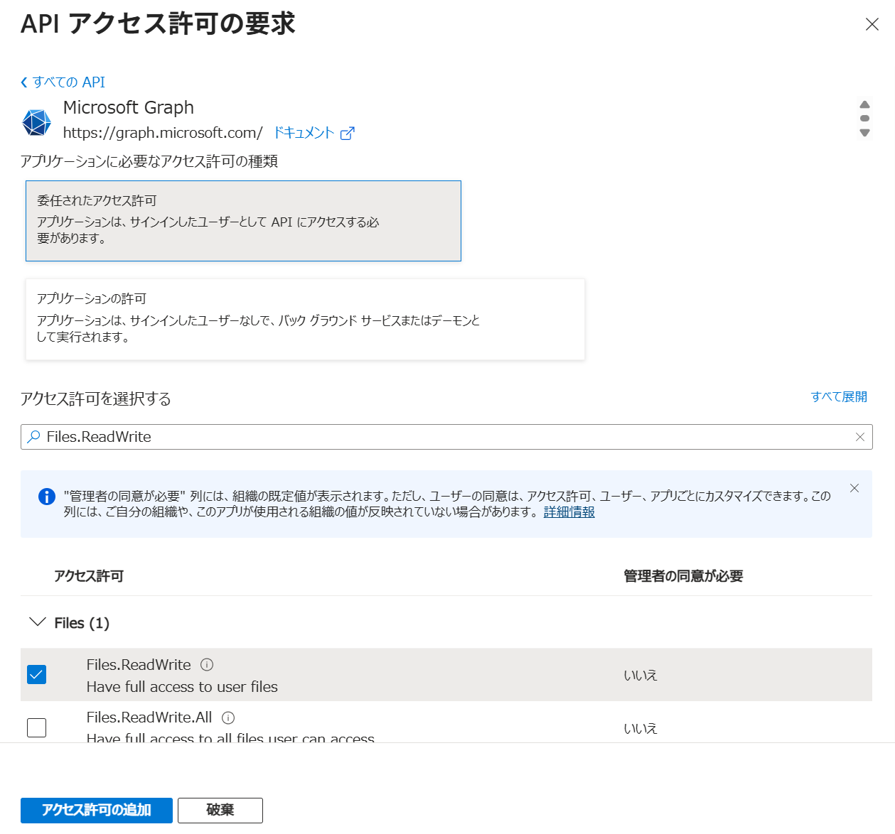


2. 追加した API アクセス許可について、テナントレベルで管理者の同意を付与します。
**構成されたアクセス許可** から、追加した API のアクセス許可が表示されていることを確認し、**Your Tenant に管理者の同意を与えます** をクリックします。
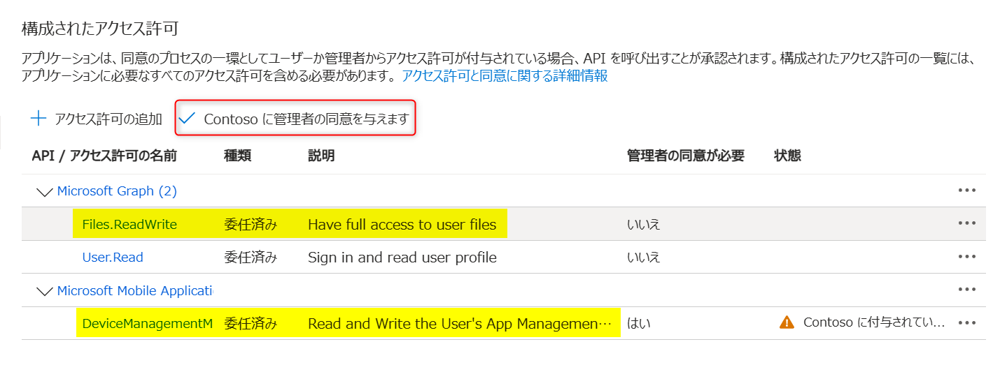


3. **エンタープライズアプリ** から作成したアプリを検索し、**アクセス許可** の画面を開きます。追加したアクセス許可が表示されていることを確認し、**Your Tenant に管理者の同意を与えます** をクリックします。
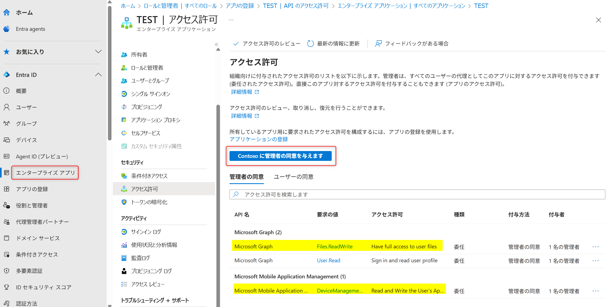

</details>

<details>
<summary><h2>8. 環境依存のコードを修正</h2></summary>

### 8.1 Config ファイルの修正

**ファイル**: `app/src/main/java/com/hatakemu/android/mamtest/config/AppConfig.kt`

**YOUR_TENANT_ID_HERE** にそれぞれの環境のテナント ID を設定します。

```kotlin
object AppConfig {
    // === 自分のテナントIDに変更 ===
    const val TENANT_ID: String = "YOUR_TENANT_ID_HERE"
    const val TENANT_AUTHORITY: String = "https://login.microsoftonline.com/$TENANT_ID"

    // === MAM サインイン スコープ（特に機能を追加しない限り変更不要）===
    const val MAM_SIGNIN_SCOPE: String = "https://msmamservice.api.application/.default"
}
```

### 8.2 MSAL設定ファイルの更新

**ファイル**: `app/src/debug/res/raw/msal_config.json`

以下をそれぞれの環境に合わせて設定します。
   - **YOUR_CLIENT_ID_HERE**: Entra アプリの App ID
   - **YYOUR_PACKAGE_NAME**: パッケージ名
   - **YOUR_DEBUG_SIGNATURE_HASH**: デバッグ用のキーのハッシュ値
   - **YOUR_TENANT_ID_HERE**: Entra のテナント ID

```json
{
  "client_id": "YOUR_CLIENT_ID_HERE",
  "authorization_user_agent": "DEFAULT",
  "redirect_uri": "msauth://YOUR_PACKAGE_NAME/YOUR_DEBUG_SIGNATURE_HASH",
  "broker_redirect_uri_registered": true,
  "account_mode": "SINGLE",
  "authorities": [
    {
      "type": "AAD",
      "audience": {
        "type": "AzureADMyOrg",
        "tenant_id": "YOUR_TENANT_ID_HERE"
      }
    }
  ]
}
```

**ファイル**: `app/src/release/res/raw/msal_config.json`

以下をそれぞれの環境に合わせて設定します。
   - **YOUR_CLIENT_ID_HERE**: Entra アプリの App ID
   - **YYOUR_PACKAGE_NAME**: パッケージ名
   - **YOUR_RELEASE_SIGNATURE_HASH**: リリース用のキーのハッシュ値
   - **YOUR_TENANT_ID_HERE**: Entra のテナント ID

```json
{
  "client_id": "YOUR_CLIENT_ID_HERE",
  "authorization_user_agent": "DEFAULT",
  "redirect_uri": "msauth://YOUR_PACKAGE_NAME/YOUR_RELEASE_SIGNATURE_HASH",
  "broker_redirect_uri_registered": true,
  "account_mode": "SINGLE",
  "authorities": [
    {
      "type": "AAD",
      "audience": {
        "type": "AzureADMyOrg",
        "tenant_id": "YOUR_TENANT_ID_HERE"
      }
    }
  ]
}
```

**注意**
**msal_config.json** に記述するハッシュ値は、URLエンコードする必要があります。最後の **=** は **%3D** に置き換えてください。(Entra のアプリの **MSAL 構成** に表示されている redirect_uri をそのまま記述してください。) 


### 8.3 build.gradle.kts の署名設定更新

**ファイル**: `app/build.gradle.kts`

以下をそれぞれの環境に合わせて設定します。
   - **storeFile**: リリースビルド用のキーストアのパスを記述します。
   - **storePassword**: リリースビルド用のキーストアのパスワードを環境変数 **AND_REL_KEYSTORE_PASS** にセットするか、**YOUR_KEYSTORE_PASSWORD** に記述します。
   - **keyAlias**: リリースビルド用のキーのエイリアスを記述します。
   - **keyPassword**: リリースビルド用のキーのパスワードを環境変数 **AND_REL_KEY_PASS** にセットするか、**YOUR_KEY_PASSWORD** に記述します。
  
```kotlin
signingConfigs {
    create("release") {
        storeFile = file("C:\\path\\to\\your\\release.keystore")
        storePassword = System.getenv("AND_REL_KEYSTORE_PASS") ?: "YOUR_KEYSTORE_PASSWORD"
        keyAlias = "key0"
        keyPassword = System.getenv("AND_REL_KEY_PASS") ?: "YOUR_KEY_PASSWORD"
    }
}
```

- **YOUR_DEBUG_HASH**: デバッグ用のキーのハッシュを指定します。
- **YOUR_RELEASE_HASH**: リリース用のキーのハッシュを指定します。

```kotlin
buildTypes {
    getByName("debug") {
        manifestPlaceholders.put("redirectPath", "/YOUR_DEBUG_HASH")
    }
    getByName("release") {
        signingConfig = signingConfigs.getByName("release")
        manifestPlaceholders.put("redirectPath", "/YOUR_RELEASE_HASH")
        // ...
    }
}
```

**注意**
**build.gradle.kts** に記述するハッシュ値は、URLエンコードする必要はありません。最後の **=** はそのまま記述します。

</details>

<details>
<summary><h2>9. ビルドと実行</h2></summary>

### 9.1 デバッグビルドと実行

1. Android Studio の右上にある **"Gradle Sync"** のボタンをクリックします。
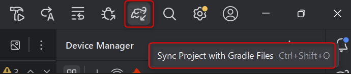

コマンドを利用する場合、以下を実行します。
```powershell
cd <プロジェクトフォルダー>
.\gradlew.bat sync
```

2. Android Studio で、**"Build"** - **"Clean Project"** を実行します。

3. **"Run"** ボタン ▷ からデバッグ実行できます。

コマンドでデバッグビルドを行う場合、以下を実行します。
```powershell
cd <プロジェクトフォルダー>
.\gradlew.bat assembleDebug
```

**注意**
MAM を適用するためには、ポータルサイトアプリをデバイスにインストールする必要があります。

### 9.2 リリースビルド

1. **手順 8.3** で、キーストアとキーのパスワードが、環境変数に設定されているか、 build.gradle.kts に記述されていることを確認します。

```powershell
# 環境変数を設定
$env:AND_REL_KEYSTORE_PASS = "your_keystore_password"
$env:AND_REL_KEY_PASS = "your_key_password"
```

2. Android Studio で **"Build"** → **"Generate Signed App Bundle or APK..."** を選択します。

3. **APK** を選択して **Next** をクリックします。

4. 作成したリリース用のキーストアが選択されていることを確認し、**Next** をクリックします。

5. **"Build Variants"** で **"release"** を選択して、**"Create"** します。
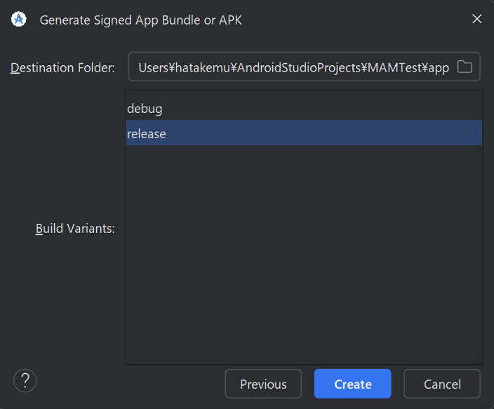

ビルドに成功すると、以下の通知が表示されます。
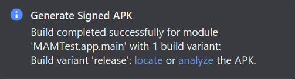

locate のリンク先（`<プロジェクトフォルダー>\app\release`）に `app-release.apk` が作成されます。
Google Managed Play の限定公開アプリとして、このリリースビルド用の `.apk` をアップロードして公開し、デバイスに配布することができます。

**注意**
`.apk` を更新したい場合には、`app/build.gradle.kts` でアプリのバージョンを上げないと、Google Play 側で蹴られてしまうので注意してください。

```kotlin
defaultConfig {
    applicationId = "com.hatakemu.android.mamtest"
    minSdk = 26
    targetSdk = 34
    versionCode = 2 ★
    versionName = "2.0" ★

    testInstrumentationRunner = "androidx.test.runner.AndroidJUnitRunner"
}
```

コマンドでリリースビルドを行う場合、以下を実行します。
```powershell
cd <プロジェクトフォルダー>
.\gradlew.bat assembleRelease
```

</details>

<details>
<summary><h2>10. 動作イメージ</h2></summary>

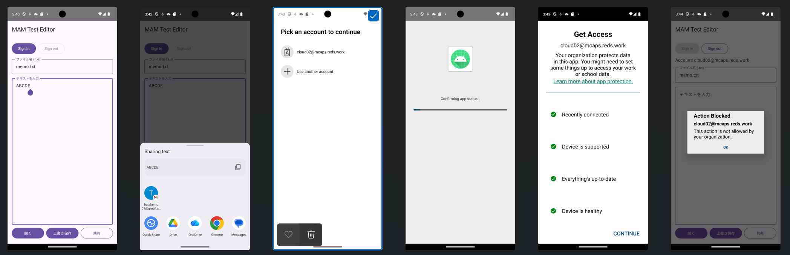

</details>
